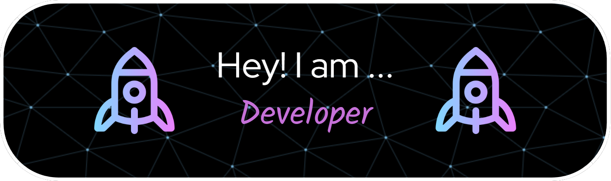

# Hi there 👋

🚀 Software Engineer | 🌟 Problem Solver | 📚 Lifelong Learner

# 🧑‍💻 About Me

**👋Hi!** I'm **_Nguyen Dinh Nam_**, a passionate Newbie-Developer dedicated to building robust and user-friendly applications.👨‍💻 I thrive in environments that challenge my creativity and problem-solving skills.

🌍 **_Based in_** Ha Noi, Viet Nam  
💻 Currently in the final stretch of my engineer's degree in **_Information Technology at PTIT_**, honing my skills in web development and gaining hands-on experience in system integration and optimization.  
🌱 On the journey to becoming a **_full-stack developer_** by improving my expertise in **_MERN stack_** and learning **_deployment techniques_** using **_Docker and Kubernetes._**  
📫 **_Reach me:_** ngdnam03@gmail.com  
😄 **_Pronouns:_** Call me **Tom**  
**_⚡ Fun fact:_** My journey with IT started when I was a kid, and let's just say I might have broken nearly every the electronics at home!😁  
The cover photo captures me with these gadgets... before they became **_"victims"_** of my early tech experiments! 😜

---

# 🚀 Languages and Tools I Use

<!-- Các phần tử trong HTML -->

💻 Programming Languages 

  
  
  
  
  
  

⚙️ Framework

  
  
  
  
  
  

🗄️ Database

  

🤖 AI

  
  
  

🐋 DevOps

  

🧪 Test and Automation

  
  
  
  

🛠️ Other

  
  
  

---

# 🤝 Let's Connect

###

 

<picture>
<source media="(prefers-color-scheme: dark)" srcset="https://raw.githubusercontent.com/tobiasmeyhoefer/tobiasmeyhoefer/output/github-snake-dark.svg" />
<source media="(prefers-color-scheme: light)" srcset="https://raw.githubusercontent.com/tobiasmeyhoefer/tobiasmeyhoefer/output/github-snake.svg" />

</picture>

###

---

## **✍️Random Dev Quote**

